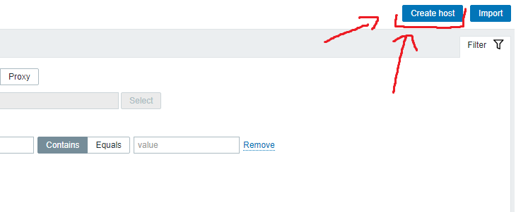

# ZABBIX PROJECT
Instrukcja i sprawozdanie z instalacji oraz konfiguracji zabbixa. Dodatkowym zadaniem projektu jest uruchomienie działającej usługi podobnej do [Network Weathermap](https://www.network-weathermap.com). System monitorujący postaram się postawić na maszynie z CentOS'em oraz obserwować maszyny z CentOS/Debian/Kali.

## Research ogólny 
- [Zabbix eng wikipedia](https://en.wikipedia.org/wiki/Zabbix), [Zabbix rus wikipedia](https://ru.wikipedia.org/wiki/Zabbix) - ogólne informacje o usłudze. Ponieważ 30 czerwca skończyło się wsparcie dla wersji 4.x będę instalował usługę w wersji 5.x.
- [Zabbix wiki](https://zabbix.org/wiki/Main_Page) - zabbixowa wiki - tutaj są informacje odnośnie instalacji i w sumie wszystkiego co może nas interesować
- [Strona zabbixa](https://www.zabbix.com) - tutaj są linki do wszystkich ważnych stron
- [Poradnik do instalacji zabbixa](https://www.howtoforge.com/tutorial/centos-zabbix-system-monitoring/) - z tego korzystam do instalacji oraz konfiguracji
- [Oficjalny poradnik do instalacji zabbixa](https://www.zabbix.com/download?zabbix=5.0&os_distribution=centos&os_version=8&db=mysql&ws=apache) - ten powyżej okazał się dość słaby i znalazłem oficjalny poradnik, dlatego z tego też będę korzystał

## Instalacja
1. Instalację zaczynam od postawienia maszyny z CentOSem, natomiast opis tego kroku pomijam - jest w projekcie z muninem
2.  Zabbixa będę instalował z paczek, ponieważ aktualnie nie ma innego sposobu dla wersji 5.x
```bash 
:~# rpm -Uvh https://repo.zabbix.com/zabbix/5.0/rhel/8/x86_64/zabbix-release-5.0-1.el8.noarch.rpm 
:~# dnf clean all
```
3. Kolejnym krokiem jest zainstalowanie serwera, agenta oraz frontendu zabbixa
```bash
:~# dnf install zabbix-server-mysql zabbix-web-mysql zabbix-apache-conf zabbix-agent
```
4. Dodatkowo trzeba zainstalować jeszcze php oraz mysql
 ```bash
 :~# dnf install mysql
 :~# dnf install php
 ```
 5. Następnie trzeba skonfigurować mysql oraz stworzyć bazę danych dla zabbixa
 ```bash
 :~# systemctl start mysqld.service
 :~# mysql_secure_installation
 ```
   6. Teraz można zabrać sie za konfigurację mysql'a . Po wejściu do mysql'a trzeba stworzyć bazę danych oraz użytkownika zabbix, któremu damy uprawnienia do bd
  ```bash
  :~# mysql -u root -p
  ```
  ```sql
  mysql> create database zabbix character set utf8 collate utf8_bin;  
mysql> create user zabbix@localhost identified by 'password';  
mysql> grant all privileges on zabbix.* to zabbix@localhost;  
mysql> quit;
```
5. Następnie trzeba zaimportować domyślne pliki sql'a. (Trochę to trwa, nie wolno przerywać!)
```bash
:~# zcat /usr/share/doc/zabbix-server-mysql*/create.sql.gz | mysql -uzabbix -p zabbix
```
6. Ustawienie hasła do bazy danych
```bash
:~# vim /etc/zabbix/zabbix_server.conf
DBPassword=password
```
7. Ustawienie strefy czasowej
```bash
:~# vim /etc/php-fpm.d/zabbix.conf
php_value[date.timezone] = Europe/Warsaw
```
  8. Ostatnim krokiem jest uruchomienie odpowiednich usług
  ```bash 
:~# systemctl enable zabbix-server zabbix-agent httpd php-fpm
:~# systemctl start zabbix-server zabbix-agent httpd php-fpm
```
## Problemy podczas instalacji
### SELinux
Jak zwykle selinux wycina zabbixa (munina też wycinał). Można to "naprawić" w prosty sposób ustawiając tryb pracy sel na "permissive" w taki sposób:
```bash
:~# setenforce 0
```
Wówczas możemy sprawdzić status
```bash
:~# sestatus
...
Current mode:                   permissive
...
```
I powinno wszystko działać. Natomiast nie jest to dobre rozwiązanie, ponieważ raczej chcemy, żeby selinux działało i możliwie dobrze chroniło.
Do [rozwiązania](https://zabbixonly.com/how-to-create-selinux-policies-for-zabbix/) tego problemu można wykorzystać sprytne narzędzie jakim jest audit2allow. Generuje ono polityki dla SELinux na podstawie logów operacji odrzucenia (również ciekawym narzędziem jest audit2why, które tłumaczy użytkownikowi dlaczego został odrzucony).
```bash
:~# cat /var/log/audit/audit.log | grep zabbix_server | grep denied | audit2allow -M zabbix_server.limits
```
To polecenie stworzy nam politykę dla SEL, następnie musimy ją załadować
```bash
:~# semodule -i zabbix_server.limits.pp
```
Teraz można uruchomić zabbix-server i powinno być wszystko w porządku
```bash
:~# systemctl start zabbix-server
```
### HTTPD
Tutaj również pojawił się problem, nie z SELinux natomiast z firewall-cmd. To możemy naprawić w dość prosty sposób:
```bash
:~# firewall-cmd --permanent --add-port=80/tcp
:~# firewall-cmd --reload
```
Wówczas powinien nam się pojawić ruch na danym porcie, gdy będziemy próbowali się dostać do zabbixa (i powinno działać)
## Dodawanie hostów do Zabbixa
Aby dodać hosta do zabbixa trzeba wejść w Configuration->Hosts, następnie musimy wejśc w zakładkę "Create Host" 
 
Następnie musimy podać dane naszego hosta. 

